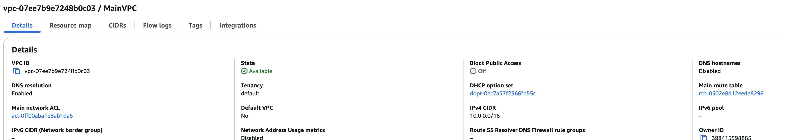
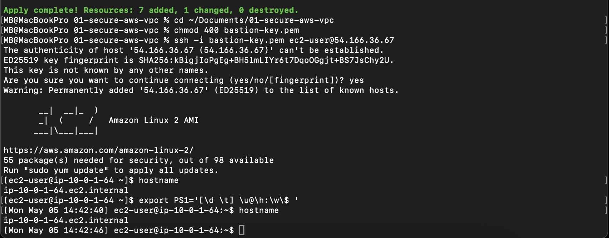
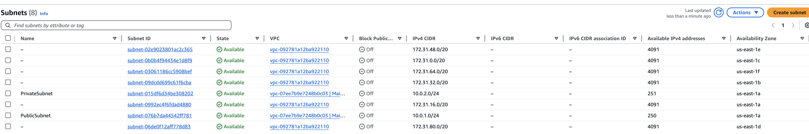

<h1 align="center">🔐 Secure AWS VPC Deployment (Terraform)</h1>

<p align="center">
  
  
  
  
</p>

---

## 📑 Table of Contents
- [Tech Stack](#️-tech-stack)
- [Security Highlights](#-security-highlights)
- [Infrastructure Deployed](#️-infrastructure-deployed)
- [Deploy It Yourself](#-deploy-it-yourself)
- [What I Practiced / Learned](#️-what-i-practiced--learned)
- [What's Next](#️-whats-next)
- [Architecture Diagram](#️-architecture-diagram)
- [Deployment Proof](#️-deployment-proof)
- [Author](#️-author)

---

## ⚙️ Tech Stack
- **☁️ Cloud Provider**: AWS
- **🛠️ IaC Tool**: Terraform (v1.5.7)
- **📍 Region**: us-east-1
- **📦 CIDR**: `10.0.0.0/16`

---

## 🔐 Security Highlights
- Custom VPC only (no default VPC)
- Designed for **least privilege** and **network segmentation**
- Deployable via Git + Terraform CLI (CI/CD friendly)
- Future-ready for compliance tagging (SOC2, GDPR)

---

## 🧱 Infrastructure Deployed
| Resource     | Details          |
|--------------|------------------|
| `aws_vpc`    | Custom VPC with Name tag `MainVPC` |
| CIDR Block   | `10.0.0.0/16`    |
| Region       | us-east-1        |

---

## 🚀 Deploy It Yourself

Clone the repo:

```bash
git clone https://github.com/Cloudby-MB/01-secure-aws-vpc.git
cd 01-secure-aws-vpc
terraform init
terraform plan
terraform apply
```

---

## 💡 What I Practiced / Learned
- Structured Terraform provider/resource blocks properly
- Built a secure, custom VPC
- Used Git + Terraform CLI instead of clicking through AWS Console
- Validated infrastructure through AWS Management Console
- Followed Infrastructure as Code (IaC) best practices

---

## 🛠️ What's Next
- Add public and private subnets
- Deploy a Bastion Host for secure access
- Create route tables and connect to Internet Gateway and NAT Gateway
- Lock down access with IAM roles and Security Groups
- Integrate tfsec, Bandit, and Snyk for security scanning

---

## 🖥️ Architecture Diagram

> Full infrastructure overview:


---

## 📸 Deployment Proof

Here is proof of the successful VPC deployment:




---

## 📸 Subnets Deployment Proof

Here is proof of the deployed **Public** and **Private** subnets, as seen in the AWS Management Console:



---

## 🧑‍💻 Author

**Cloudby-MB**  
_Building secure cloud environments with automation-first principles._